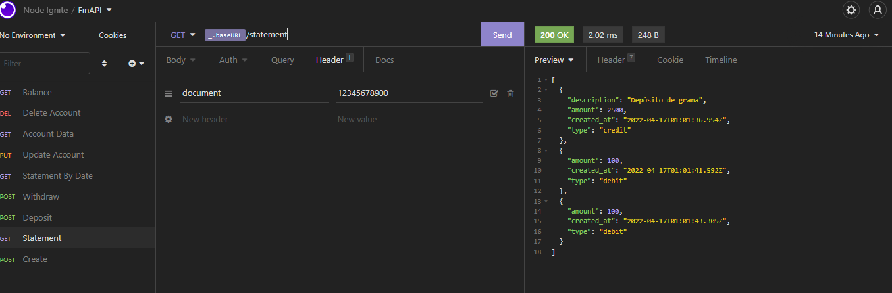

# FinAPI

FinAPI é uma API de pagamentos, construída em Node e Express.

<h2>Como usar?</h2>

1. Clone o repositório git em sua máquina.

2. Instale as dependências pelo terminal, digitando "yarn".

3. Crie as rotas /account, /statement, / deposit, /withdraw, /statement/date, /balance no client (Insomnia, Postman), de acordo com os métodos HTTP de cada uma.

4. Está pronto para ser testado!

<h2>Licença</h2>

MIT (Massachusetts Institute of Technology)

